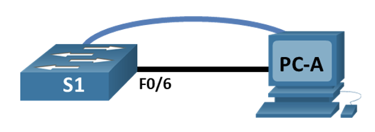
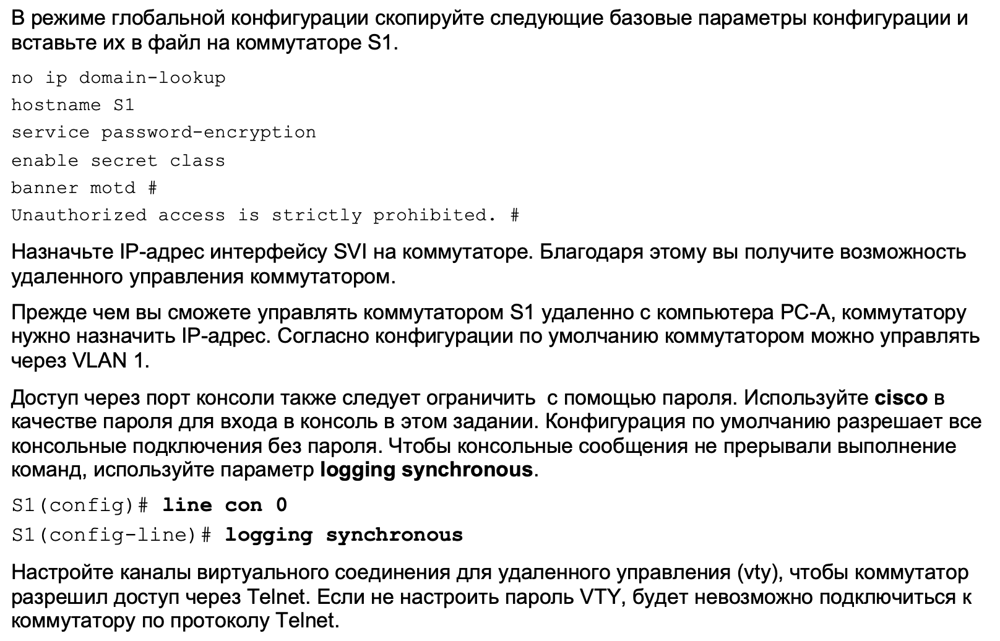
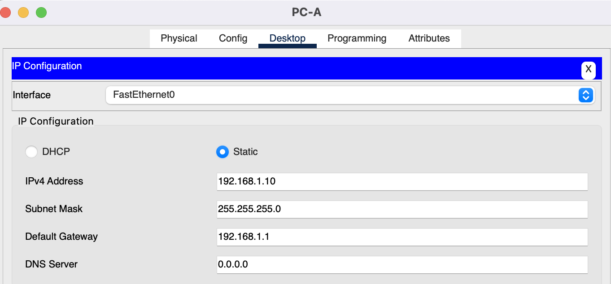

## 0. Лабораторная работа. Базовая настройка коммутатора
____

**Топология сети**



**Таблица адресации**
| Устройство | Интерфейс | IP-адрес / префикс |
| ---------- |-----------| -------------------|
| S1         |   VLAN 1  | 192.168.1.2 /24    |
| PC-A       |    NIC    | 192.168.1.10 /24   |

**Задачи лабораторной работы:**
1. Проверка конфигурации коммутатора по умолчанию
2. Создание сети и настройка основных параметров устройства
3. Проверка сетевых подключений. Выгрузка конфигураций
___

## 1. Выполним первое подключение к коммутатору и проверим конфигурации оборудования по умолчанию

**1.1. Построим сеть**


**1.2. Первое подключение через консоль**

В исходном состоянии оборудование не настроенно. Отсутствует конфигурация порта VLAN 1. Подключение по Telnet и SHH невозможно.
Подключим консольный провод от роутера к COM порту PC (интерфейс RS-232) и откроем терминал

**1.3. Ознакомимся с конфигурацией running-config**
```
Switch#show running-config
Building configuration...

Current configuration : 1080 bytes
!
version 15.0
no service timestamps log datetime msec
no service timestamps debug datetime msec
no service password-encryption
!
hostname Switch
!
!
!
!
!
!
spanning-tree mode pvst
spanning-tree extend system-id
!
interface FastEthernet0/1
!
interface FastEthernet0/2
!
interface FastEthernet0/3
!
interface FastEthernet0/4
!
interface FastEthernet0/5
!
interface FastEthernet0/6
!
interface FastEthernet0/7
!
interface FastEthernet0/8
!
interface FastEthernet0/9
!
interface FastEthernet0/10
!
interface FastEthernet0/11
!
interface FastEthernet0/12
!
interface FastEthernet0/13
!
interface FastEthernet0/14
!
interface FastEthernet0/15
!
interface FastEthernet0/16
!
interface FastEthernet0/17
!
interface FastEthernet0/18
!
interface FastEthernet0/19
!
interface FastEthernet0/20
!
interface FastEthernet0/21
!
interface FastEthernet0/22
!
interface FastEthernet0/23
!
interface FastEthernet0/24
!
interface GigabitEthernet0/1
!
interface GigabitEthernet0/2
!
interface Vlan1
 no ip address
 shutdown
!
!
!
!
line con 0
!
line vty 0 4
 login
line vty 5 15
 login
!
!
!
!
end
```
На роутера имеется 24 порта Fa, 2 порта Gi, 1 интерфейс VLAN1 и 16 настраиваемых виртуальных линий vty

**1.4. Проверим конфигурацию startup-config**

Так как еще ни каких изменений в run-config не вносили, конфигурацию в startup-config не копировали, то в соответствующей директории памяти файл с конфигурацией startup отсутствует.
```
Switch#show startup-config
startup-config is not present
Switch#
Switch#show flash
Directory of flash:/

    1  -rw-     4670455          <no date>  2960-lanbasek9-mz.150-2.SE4.bin

64016384 bytes total (59345929 bytes free)
```

**1.5. Ознакомимся с конфигурацией VLAN 1**

Из конфигурации по команде *show interface vlan 1* как и из команды *show running-config* видно, что интерфейс не активен, ip Address не задан. Можем увидеть MAC адрес 0060.3e37.1795
А также МОРЕ служебной информации, о которой я очень надеюсь мне расскажут преподаватели на предстоящем курсе. 

```
Switch#show interface vlan 1
Vlan1 is administratively down, line protocol is down
  Hardware is CPU Interface, address is 0060.3e37.1795 (bia 0060.3e37.1795)
  MTU 1500 bytes, BW 100000 Kbit, DLY 1000000 usec,
     reliability 255/255, txload 1/255, rxload 1/255
  Encapsulation ARPA, loopback not set
  ARP type: ARPA, ARP Timeout 04:00:00
  Last input 21:40:21, output never, output hang never
  Last clearing of "show interface" counters never
  Input queue: 0/75/0/0 (size/max/drops/flushes); Total output drops: 0
  Queueing strategy: fifo
  Output queue: 0/40 (size/max)
  5 minute input rate 0 bits/sec, 0 packets/sec
  5 minute output rate 0 bits/sec, 0 packets/sec
     1682 packets input, 530955 bytes, 0 no buffer
     Received 0 broadcasts (0 IP multicast)
     0 runts, 0 giants, 0 throttles
     0 input errors, 0 CRC, 0 frame, 0 overrun, 0 ignored
     563859 packets output, 0 bytes, 0 underruns
     0 output errors, 23 interface resets
     0 output buffer failures, 0 output buffers swapped out
```

Также из ранее запрошенных команд можно "вытащить" информацию о версии прошивки 15.0 и образе системы
```
1  -rw-     4670455          <no date>  2960-lanbasek9-mz.150-2.SE4.bin
```

**1.6. Познакомимся с командами *show interface f0/6* и комадной *show flash / dir flash***

Команда *show flash* показывает что находится в памяти устройства: это могут быть загрузочные конфигурации, или конфигурации которые мы можем сохранить отдельно, чтобы в дальнейшем поместить из в файл загрузочной конфигурации. Информация о FLASH памяти мы также можем узнать по команде *show startup-config*
```
Switch#show flash
Directory of flash:/

    1  -rw-     4670455          <no date>  2960-lanbasek9-mz.150-2.SE4.bin

64016384 bytes total (59345929 bytes free)
```

Команда *show interface f0/6* так же как и в случае с командой проверки интерфейса VLAN1 показывает состояние порта, его МАС Address и много-много служебной информации про его пропускные способности и пр.

```
Switch#show interface fa 0/6
FastEthernet0/6 is down, line protocol is down (disabled)
  Hardware is Lance, address is 0090.2161.de06 (bia 0090.2161.de06)
 BW 100000 Kbit, DLY 1000 usec,
     reliability 255/255, txload 1/255, rxload 1/255
  Encapsulation ARPA, loopback not set
  Keepalive set (10 sec)
  Half-duplex, 100Mb/s
  input flow-control is off, output flow-control is off
  ARP type: ARPA, ARP Timeout 04:00:00
  Last input 00:00:08, output 00:00:05, output hang never
  Last clearing of "show interface" counters never
  Input queue: 0/75/0/0 (size/max/drops/flushes); Total output drops: 0
  Queueing strategy: fifo
  Output queue :0/40 (size/max)
  5 minute input rate 0 bits/sec, 0 packets/sec
  5 minute output rate 0 bits/sec, 0 packets/sec
     956 packets input, 193351 bytes, 0 no buffer
     Received 956 broadcasts, 0 runts, 0 giants, 0 throttles
     0 input errors, 0 CRC, 0 frame, 0 overrun, 0 ignored, 0 abort
     0 watchdog, 0 multicast, 0 pause input
     0 input packets with dribble condition detected
     2357 packets output, 263570 bytes, 0 underruns
     0 output errors, 0 collisions, 10 interface resets
     0 babbles, 0 late collision, 0 deferred
     0 lost carrier, 0 no carrier
     0 output buffer failures, 0 output buffers swapped out
```
## 1. Выполним начальную настройку оборудования

**2.1. Произведем настройку коммутатора используя команды и режимы согласно методических материалов**



**2.2. Настроим адресацию хосте PC-A**


  
## 3. Проверим и задокументируем итоговую конфигурацию коммутатора S1 и хоста PC-A

**3.1. Проверка параметров startup-config**
```
S1#show startup-config
Using 1351 bytes
!
version 15.0
no service timestamps log datetime msec
no service timestamps debug datetime msec
service password-encryption
!
hostname S1
!
enable secret 5 $1$mERr$9cTjUIEqNGurQiFU.ZeCi1
!
!
!
no ip domain-lookup
!
!
!
spanning-tree mode pvst
spanning-tree extend system-id
!
interface FastEthernet0/1
!
interface FastEthernet0/2
!
interface FastEthernet0/3
!
interface FastEthernet0/4
!
interface FastEthernet0/5
!
interface FastEthernet0/6
!
interface FastEthernet0/7
!
interface FastEthernet0/8
!
interface FastEthernet0/9
!
interface FastEthernet0/10
!
interface FastEthernet0/11
!
interface FastEthernet0/12
!
interface FastEthernet0/13
!
interface FastEthernet0/14
!
interface FastEthernet0/15
!
interface FastEthernet0/16
!
interface FastEthernet0/17
!
interface FastEthernet0/18
!
interface FastEthernet0/19
!
interface FastEthernet0/20
!
interface FastEthernet0/21
!
interface FastEthernet0/22
!
interface FastEthernet0/23
!
interface FastEthernet0/24
!
interface GigabitEthernet0/1
!
interface GigabitEthernet0/2
!
interface Vlan1
 ip address 192.168.1.2 255.255.255.0
!
ip default-gateway 192.168.1.1
!
banner motd ^C
Unauthorized access is strictly prohibited. ^C
!
!
!
line con 0
 password 7 0822455D0A16
 logging synchronous
 login
!
line vty 0 4
 password 7 0822455D0A16
 login
line vty 5 15
 password 7 0822455D0A16
 login
!
!
!
!
end
```
**3.2. Проверка параметров VLAN 1**
```
S1#show interface vlan 1
Vlan1 is up, line protocol is up
  Hardware is CPU Interface, address is 0060.3e37.1795 (bia 0060.3e37.1795)
  Internet address is 192.168.1.2/24
  MTU 1500 bytes, BW 100000 Kbit, DLY 1000000 usec,
     reliability 255/255, txload 1/255, rxload 1/255
  Encapsulation ARPA, loopback not set
  ARP type: ARPA, ARP Timeout 04:00:00
  Last input 21:40:21, output never, output hang never
  Last clearing of "show interface" counters never
  Input queue: 0/75/0/0 (size/max/drops/flushes); Total output drops: 0
  Queueing strategy: fifo
  Output queue: 0/40 (size/max)
  5 minute input rate 0 bits/sec, 0 packets/sec
  5 minute output rate 0 bits/sec, 0 packets/sec
     1682 packets input, 530955 bytes, 0 no buffer
     Received 0 broadcasts (0 IP multicast)
     0 runts, 0 giants, 0 throttles
     0 input errors, 0 CRC, 0 frame, 0 overrun, 0 ignored
     563859 packets output, 0 bytes, 0 underruns
     0 output errors, 23 interface resets
     0 output buffer failures, 0 output buffers swapped out
```
**3.3. Тест сквозного соединения**
```
C:\>ping 192.168.1.2

Pinging 192.168.1.2 with 32 bytes of data:

Reply from 192.168.1.2: bytes=32 time<1ms TTL=255
Reply from 192.168.1.2: bytes=32 time<1ms TTL=255
Reply from 192.168.1.2: bytes=32 time<1ms TTL=255
Reply from 192.168.1.2: bytes=32 time<1ms TTL=255

Ping statistics for 192.168.1.2:
    Packets: Sent = 4, Received = 4, Lost = 0 (0% loss),
Approximate round trip times in milli-seconds:
    Minimum = 0ms, Maximum = 0ms, Average = 0ms

C:\>ping 192.168.1.10

Pinging 192.168.1.10 with 32 bytes of data:

Reply from 192.168.1.10: bytes=32 time=27ms TTL=128
Reply from 192.168.1.10: bytes=32 time=16ms TTL=128
Reply from 192.168.1.10: bytes=32 time<1ms TTL=128
Reply from 192.168.1.10: bytes=32 time=17ms TTL=128

Ping statistics for 192.168.1.10:
    Packets: Sent = 4, Received = 4, Lost = 0 (0% loss),
Approximate round trip times in milli-seconds:
    Minimum = 0ms, Maximum = 27ms, Average = 15ms
```
**3.4. Проверка удаленного управления коммутатором S1 с помощью Telnet**
```
Trying 192.168.1.2 ...Open
Unauthorized access is strictly prohibited. 


User Access Verification

Password: 
S1>en
Password: 
S1#
```
___
## ВЫВОД: если долго и упорно сидеть перед командной строкой, то не смотря на то что у тебя лапти - все начинает получаеться.

