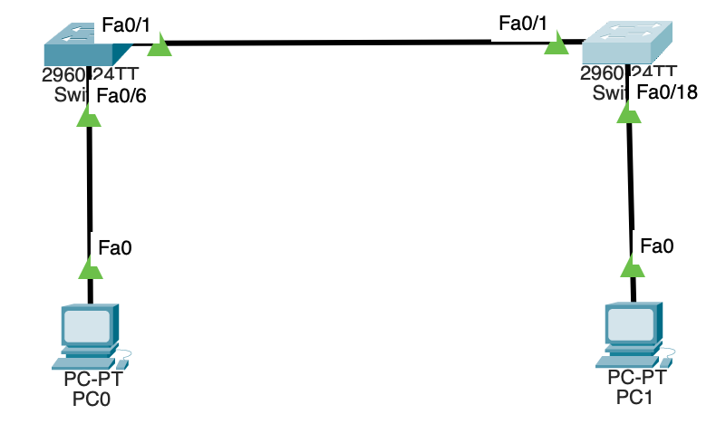

## 2. Лабораторная работа. Просмотр таблицы MAC-адресов коммутатора
____

**Топология сети**

**Таблица адресации**
| Устройство | Интерфейс | IP-адрес        | Маска подсети |
| ---------- | --------- | --------------- | ------------- |
| S1         | VLAN 1    | 192.168.1.11    | 255.255.255.0 |
| S2         | VLAN 1    | 192.168.1.12    | 255.255.255.0 |
| PC-A       | NIC       | 192.168.1.1     | 255.255.255.0 |
| PC-B       | NIC       | 192.168.1.2     | 255.255.255.0 |

**Задачи лабораторной работы:**
1. Создание и настройка сети
2. Изучение таблицы MAC-адресов коммутатора
___

 **1.1 Построим сеть**
В соответствии с заданной топологией смоделируем сеть в Cisco Packet Tracer и отобразим интерфейсы на устройстве

1.2 Выполним настройку узлов ПК