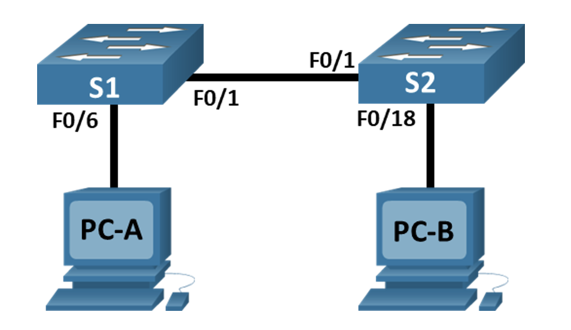
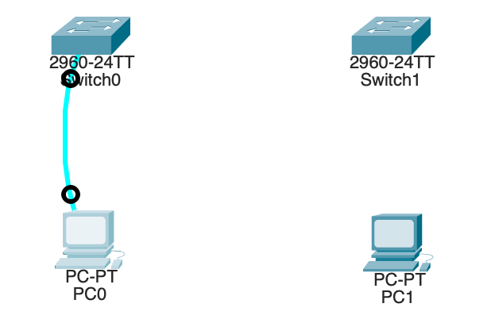
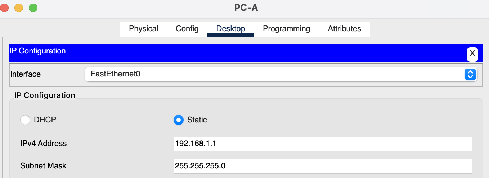
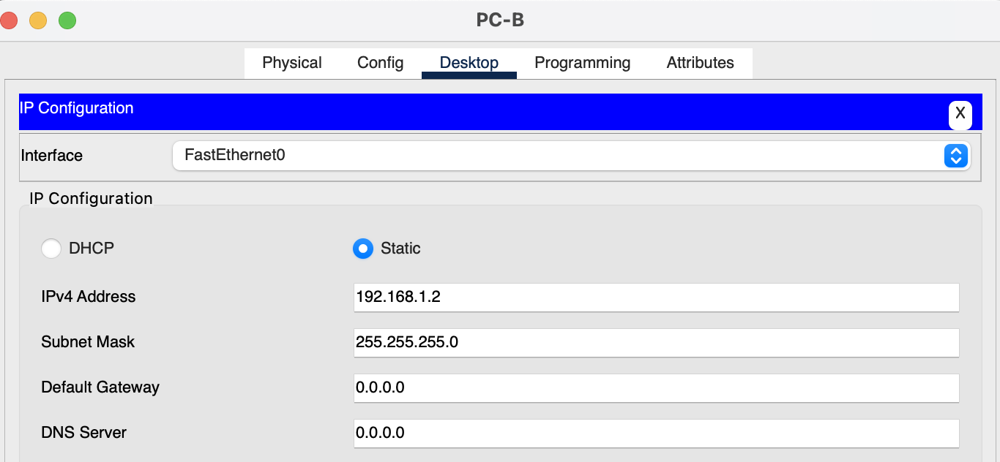
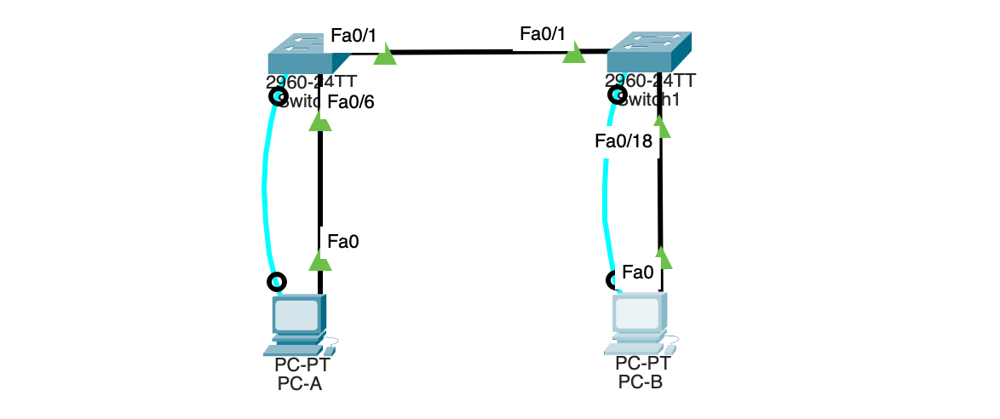

## 2. Лабораторная работа. Просмотр таблицы MAC-адресов коммутатора
____

**Топология сети**



**Таблица адресации**
| Устройство | Интерфейс | IP-адрес        | Маска подсети |
| ---------- | --------- | --------------- | ------------- |
| S1         | VLAN 1    | 192.168.1.11    | 255.255.255.0 |
| S2         | VLAN 1    | 192.168.1.12    | 255.255.255.0 |
| PC-A       | NIC       | 192.168.1.1     | 255.255.255.0 |
| PC-B       | NIC       | 192.168.1.2     | 255.255.255.0 |

**Задачи лабораторной работы:**
1. Создание и настройка сети
2. Изучение таблицы MAC-адресов коммутатора
___

 **1.1 Построим сеть**
В соответствии с заданной топологией смоделируем сеть в Cisco Packet Tracer и подключим консольный кабель к коммутатору



1.2.1 Переименуем узел ПК PC-A, зададим IP адрес и маску подсети в соответствии с таблицей адресами



1.2.2 Повторим действия из п.1.2.1 со вторым узлом ПК



1.3 Так как работаем в виртуальный среде CPT выполнять инициализацию и перегрузку коммутаторов не требуется

1.4.1 Настроим базовые параметры коммутатора S1

```
Switch>
Switch>
Switch>en
Switch#conf terminal 
Enter configuration commands, one per line.  End with CNTL/Z.
Switch(config)#hostname S1
S1(config)#
S1(config)#	
S1(config)#int vlan 1
S1(config-if)#ip add 192.168.1.11 255.255.255.0
S1(config-if)#exit
S1(config)#
S1(config)#
S1(config)#service password-encryption 
S1(config)#enable secret class
S1(config)#no ip domain-lookup
S1(config)#banner motd #setap s1 for lab-2#
S1(config)#exit
S1#
%SYS-5-CONFIG_I: Configured from console by console

S1#
S1#
S1#conf terminal 
Enter configuration commands, one per line.  End with CNTL/Z.
S1(config)#line VTY 0 4
S1(config-line)#login
% Login disabled on line 1, until 'password' is set
% Login disabled on line 2, until 'password' is set
% Login disabled on line 3, until 'password' is set
% Login disabled on line 4, until 'password' is set
% Login disabled on line 5, until 'password' is set
S1(config-line)#password cisco
S1(config-line)#exit
S1(config)#exit
S1#
%SYS-5-CONFIG_I: Configured from console by console
```

1.4.2 Повторим действия для коммутатора S2, соединим узлы модели через интерфейс Ethernet и отобразим их

```
Switch>
Switch>
Switch>en
Switch#conf terminal 
Enter configuration commands, one per line.  End with CNTL/Z.
Switch(config)#hostname S2
S2(config)#
S2(config)#	
S2(config)#int vlan 1
S2(config-if)#ip add 192.168.1.12 255.255.255.0
S2(config-if)#exit
S2(config)#
S2(config)#
S2(config)#service password-encryption 
S2(config)#enable secret class
S2(config)#no ip domain-lookup
S2(config)#banner motd #setap s2 for lab-2#
S2(config)#exit
S2#
%SYS-5-CONFIG_I: Configured from console by console

S2#
S2#
S2#conf terminal 
Enter configuration commands, one per line.  End with CNTL/Z.
S2(config)#line VTY 0 4
S2(config-line)#login
% Login disabled on line 1, until 'password' is set
% Login disabled on line 2, until 'password' is set
% Login disabled on line 3, until 'password' is set
% Login disabled on line 4, until 'password' is set
% Login disabled on line 5, until 'password' is set
S2(config-line)#password cisco
S2(config-line)#exit
S2(config)#exit
S2#
%SYS-5-CONFIG_I: Configured from console by console
```



