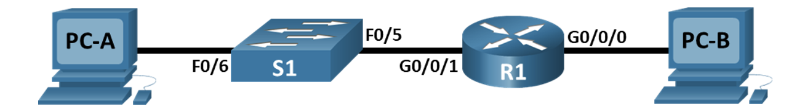
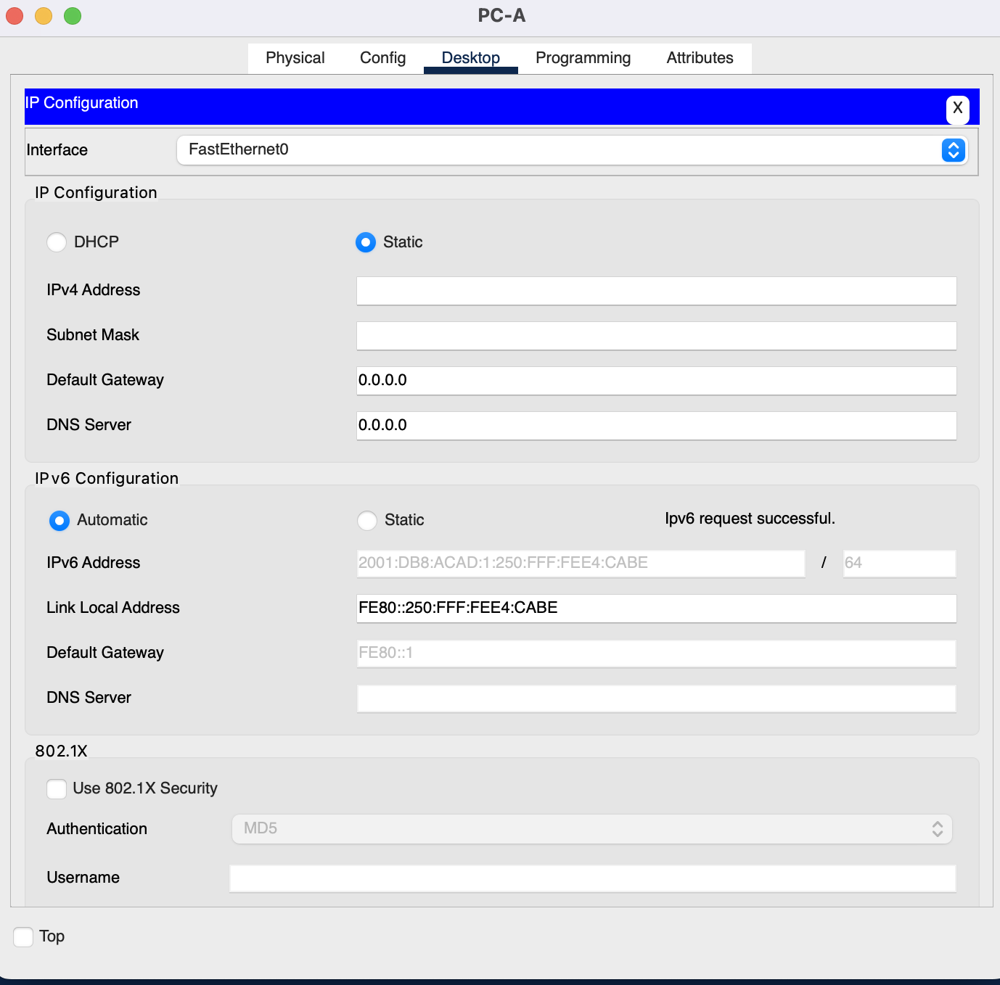
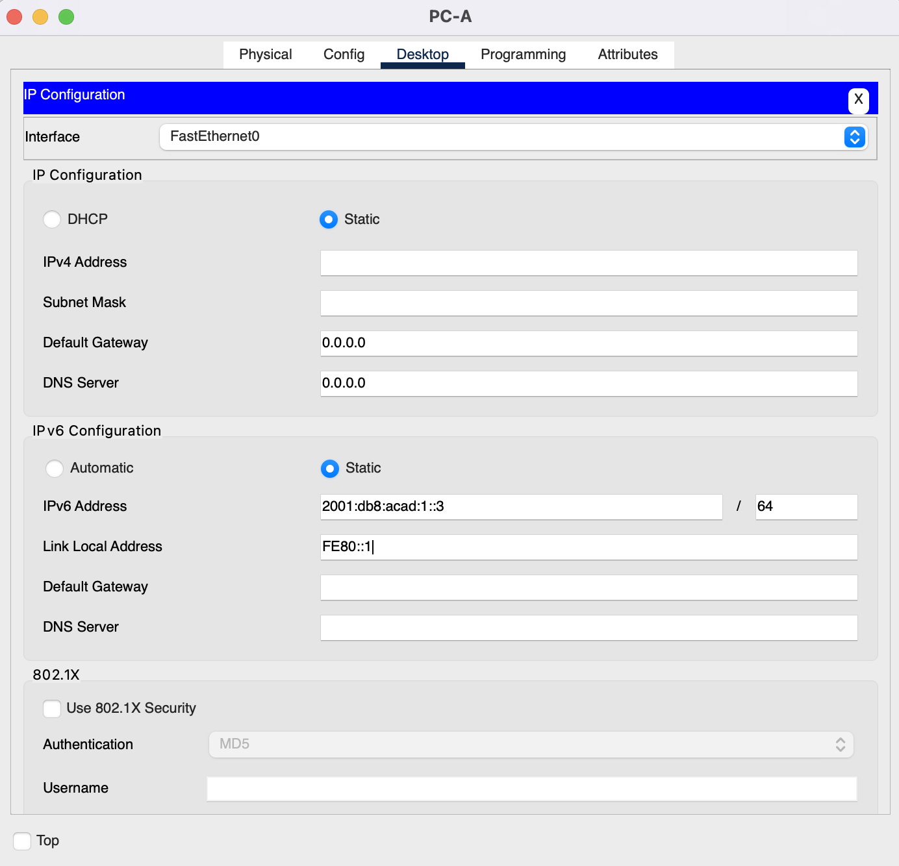
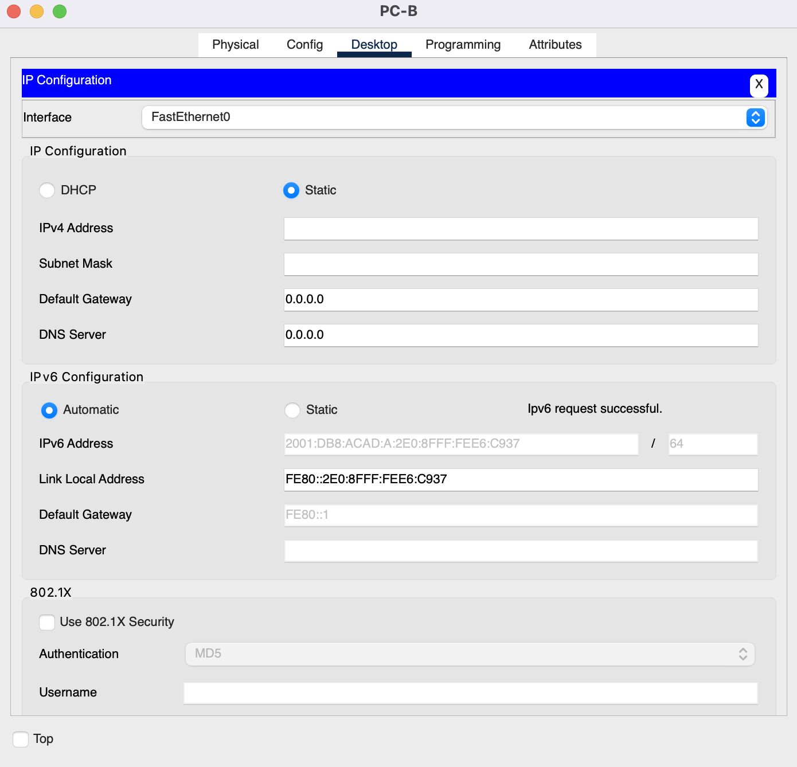
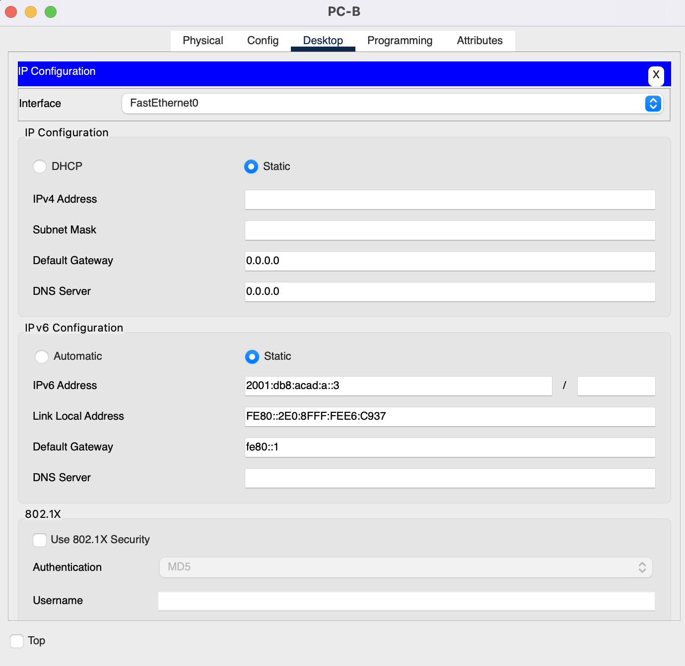

## 4. Лабораторная работа. Настройка IPv6-адресов на сетевых устройствах
____

**Топология**



**Таблица адресации**
| Устройство | Интерфейс | IPv6-адрес        | Длина префикса | Шлюз по умолчанию |
| ---------- | --------- | --------------- | ------------- | ------------- |
| R1         | G0/0/0    | 2001:db8:acad:a::1    | 64 | - |
|            | G0/0/1    | 2001:db8:acad:1::1    | 64 | - |
| S1         | VLAN 1    | 2001:db8:acad:1::b    | 64 | - |
| PC-A       | NIC       | 2001:db8:acad:1::3    | 64 | fe80::1 |
| PC-B       | NIC       | 2001:db8:acad:a::3    | 64 | fe80::1 |

**Задачи лабораторной работы:**
1. Настройка топологии конфигурации основных параметров маршрутизатор и коммутатора
2. Ручная настройка IPv6-адресов
3. Проверка сквозного соединения

___

**1. Создадим и настроим сеть**

В соответствии с заданной топологией смоделируем сеть в Cisco Packet Tracer

1.1. Настроим маршрутизатор\
Назначим имя хоста и настроим основные параметры устройства

```
Switch>en
Switch#conf term
Enter configuration commands, one per line.  End with CNTL/Z.
Switch(config)#hostname S1
S1(config)#service password-encryption
S1(config)#enable secret class
S1(config)#exit
S1#
%SYS-5-CONFIG_I: Configured from console by console
wr
Building configuration...
[OK]
S1#
```

Также установим шаблон
```
S1>en
Password: 
S1#conf term
Enter configuration commands, one per line.  End with CNTL/Z.
S1(config)#sdm prefer dual-ipv4-and-ipv6 default
Changes to the running SDM preferences have been stored, but cannot take effect until the next reload.
Use 'show sdm prefer' to see what SDM preference is currently active.
S1(config)#end
S1#
%SYS-5-CONFIG_I: Configured from console by console
wr
Building configuration...
[OK]
S1#
```

1.2. Настроим коммутатор\
Назначим имя хоста и настроим основные параметры устройства
```
Router>en
Router#conf term
Enter configuration commands, one per line.  End with CNTL/Z.
Router(config)#hostname R1
R1(config)#service password-encryption
R1(config)#enable secret class
R1(config)#exit
R1#
%SYS-5-CONFIG_I: Configured from console by console
wr
Building configuration...
[OK]
R1#
```
**Модель сети**


**2. Настроим протокол IPv6**

2.1. Назначим IPv6-адреса на интерфейсах Ethernet G0/0 и G0/1 на маршрутизаторе R1

```
R1>en
Password: 
R1#conf t
Enter configuration commands, one per line.  End with CNTL/Z.
R1(config)#int g0/0
R1(config-if)#ipv6 add
R1(config-if)#ipv6 address 2001:db8:acad:a::1/64
R1(config-if)#no shutdown 
R1(config-if)#end
R1#
%SYS-5-CONFIG_I: Configured from console by console
conf t
R1#conf terminal 
Enter configuration commands, one per line.  End with CNTL/Z.
R1(config)#int g0/1
R1(config-if)#ipv6 address 2001:db8:acad:1::1/64
R1(config-if)#no shutdown 
R1(config-if)#
R1(config-if)#
%LINEPROTO-5-UPDOWN: Line protocol on Interface GigabitEthernet0/0, changed state to down

R1(config-if)#end
R1#
%SYS-5-CONFIG_I: Configured from console by console
```
2.2. Проверим, назначен ли каждому интерфейсу корректный индивидуальные IPv6-адрес
```
R1#show ipv6 interface brief
GigabitEthernet0/0         [up/down]
    FE80::202:16FF:FE24:5A01
    2001:DB8:ACAD:A::1
GigabitEthernet0/1         [up/up]
    FE80::202:16FF:FE24:5A02
    2001:DB8:ACAD:1::1
GigabitEthernet0/2         [up/down]
    unassigned
Vlan1                      [up/down]
    unassigned
R1#
```
2.3. Зададим вручную локальные адреса канала на каждом интерфейсе Ethernet на R1
```
R1>en
Password: 
R1#conf t
Enter configuration commands, one per line.  End with CNTL/Z.	
R1(config)#int g0/0
R1(config-if)#ipv6 add
R1(config-if)#ipv6 address fe80::1 l
R1(config-if)#ipv6 address fe80::1 link-local 
R1(config-if)#no sh
R1(config-if)#
R1(config-if)#end
R1#
%SYS-5-CONFIG_I: Configured from console by console
conf t
Enter configuration commands, one per line.  End with CNTL/Z.
R1(config)#int g0/1
R1(config-if)#ipv6 add
R1(config-if)#ipv6 address fe80::1 l
R1(config-if)#ipv6 address fe80::1 link-local 
R1(config-if)#no sh
R1(config-if)#
R1(config-if)#end
R1#
%SYS-5-CONFIG_I: Configured from console by console
```
2.4. Убедимся что локальные адреса на интерфейсах выбраны fe80::1
```
R1# show ipv6 interface brief
GigabitEthernet0/0         [up/down]
    FE80::1
    2001:DB8:ACAD:A::1
GigabitEthernet0/1         [up/up]
    FE80::1
    2001:DB8:ACAD:1::1
GigabitEthernet0/2         [up/down]
    unassigned
Vlan1                      [up/down]
    unassigned
R1#
```
2.5. Проверим данные IPv6-адреса на PC-B
```
Cisco Packet Tracer PC Command Line 1.0
C:\>ipconfig

FastEthernet0 Connection:(default port)

   Connection-specific DNS Suffix..: 
   Link-local IPv6 Address.........: FE80::2E0:8FFF:FEE6:C937
   IPv6 Address....................: ::
   IPv4 Address....................: 0.0.0.0
   Subnet Mask.....................: 0.0.0.0
   Default Gateway.................: ::
                                     0.0.0.0

Bluetooth Connection:

   Connection-specific DNS Suffix..: 
   Link-local IPv6 Address.........: ::
   IPv6 Address....................: ::
   IPv4 Address....................: 0.0.0.0
   Subnet Mask.....................: 0.0.0.0
   Default Gateway.................: ::
                                     0.0.0.0

C:\>
```
На интерфейсе задан локальный адрес\
Link-local IPv6 Address.........: FE80::2E0:8FFF:FEE6:C937\
Глобальный адрес отсутствует

2.6. Активируем IPv6-маршрутизацию на R1 c помощью команды **IPv6 unicast-routing**
```
R1>en
Password: 
R1#conf t
Enter configuration commands, one per line.  End with CNTL/Z.
R1(config)#IPv6 unicast-routing
R1(config)#end
R1#
%SYS-5-CONFIG_I: Configured from console by console
wr
Building configuration...
[OK]
R1#
```
2.7. Обновим данные IPv6-адреса на PC-B
```
C:\>ipconfig

FastEthernet0 Connection:(default port)

   Connection-specific DNS Suffix..: 
   Link-local IPv6 Address.........: FE80::2E0:8FFF:FEE6:C937
   IPv6 Address....................: 2001:DB8:ACAD:A:2E0:8FFF:FEE6:C937
   IPv4 Address....................: 0.0.0.0
   Subnet Mask.....................: 0.0.0.0
   Default Gateway.................: FE80::1
                                     0.0.0.0

Bluetooth Connection:

   Connection-specific DNS Suffix..: 
   Link-local IPv6 Address.........: ::
   IPv6 Address....................: ::
   IPv4 Address....................: 0.0.0.0
   Subnet Mask.....................: 0.0.0.0
   Default Gateway.................: ::
                                     0.0.0.0

C:\>
```
PC-B получил глобальный адрес и данные шлюза.


2.8. Назначим IPv6-адрес для SVI на S1 и назначим этому интерфейсу локальный адрес канала fe80::b
```
S1>en
Password: 
S1#int vlan 1
       ^
% Invalid input detected at '^' marker.
	
S1#conf t
Enter configuration commands, one per line.  End with CNTL/Z.
S1(config)#int vlan 1
S1(config-if)#ipv6 add
S1(config-if)#ipv6 address 2001:db8:acad:1::3/64
S1(config-if)#no shu
S1(config-if)#no shutdown 

S1(config-if)#
%LINK-5-CHANGED: Interface Vlan1, changed state to up

%LINEPROTO-5-UPDOWN: Line protocol on Interface Vlan1, changed state to up
ipv6 add
S1(config-if)#ipv6 address fe80::b li
S1(config-if)#ipv6 address fe80::b link-local 
S1(config-if)#
```
Проверим правильность назначения IPv6-адресов интерфейсу управления с помощью команды **show IPv6 interface vlan 1**
```
S1(config-if)#do show ipv6 interface vlan 1
Vlan1 is up, line protocol is up
  IPv6 is enabled, link-local address is FE80::B
  No Virtual link-local address(es):
  Global unicast address(es):
    2001:DB8:ACAD:1::3, subnet is 2001:DB8:ACAD:1::/64
  Joined group address(es):
    FF02::1
    FF02::1:FF00:3
    FF02::1:FF00:B
  MTU is 1500 bytes
  ICMP error messages limited to one every 100 milliseconds
  ICMP redirects are enabled
  ICMP unreachables are sent
  Output features: Check hwidb
  ND DAD is enabled, number of DAD attempts: 1
  ND reachable time is 30000 milliseconds
S1(config-if)#end
S1#
%SYS-5-CONFIG_I: Configured from console by console
wr
Building configuration...
[OK]
S1#
```
2.9. Назначим адресацию для каждого ПК

Сначала зададим автоматическое присвоение IPv6 на PC-A и проверим конфигурацию


```
C:\>ipconfig

FastEthernet0 Connection:(default port)

   Connection-specific DNS Suffix..: 
   Link-local IPv6 Address.........: FE80::250:FFF:FEE4:CABE
   IPv6 Address....................: 2001:DB8:ACAD:1:250:FFF:FEE4:CABE
   IPv4 Address....................: 0.0.0.0
   Subnet Mask.....................: 0.0.0.0
   Default Gateway.................: FE80::1
                                     0.0.0.0

Bluetooth Connection:

   Connection-specific DNS Suffix..: 
   Link-local IPv6 Address.........: ::
   IPv6 Address....................: ::
   IPv4 Address....................: 0.0.0.0
   Subnet Mask.....................: 0.0.0.0
   Default Gateway.................: ::
                                     0.0.0.0

C:\>
```
Затем укажем IPv6 на PC-A вручную и проверим конфигурацию


```
C:\>ipconfig

FastEthernet0 Connection:(default port)

   Connection-specific DNS Suffix..: 
   Link-local IPv6 Address.........: FE80::1
   IPv6 Address....................: 2001:DB8:ACAD:1::3
   IPv4 Address....................: 0.0.0.0
   Subnet Mask.....................: 0.0.0.0
   Default Gateway.................: ::
                                     0.0.0.0

Bluetooth Connection:

   Connection-specific DNS Suffix..: 
   Link-local IPv6 Address.........: ::
   IPv6 Address....................: ::
   IPv4 Address....................: 0.0.0.0
   Subnet Mask.....................: 0.0.0.0
   Default Gateway.................: ::
                                     0.0.0.0

C:\>
```
Повторим действия для PC-B


```
C:\>ipconfig

FastEthernet0 Connection:(default port)

   Connection-specific DNS Suffix..: 
   Link-local IPv6 Address.........: FE80::2E0:8FFF:FEE6:C937
   IPv6 Address....................: 2001:DB8:ACAD:A:2E0:8FFF:FEE6:C937
   IPv4 Address....................: 0.0.0.0
   Subnet Mask.....................: 0.0.0.0
   Default Gateway.................: FE80::1
                                     0.0.0.0

Bluetooth Connection:

   Connection-specific DNS Suffix..: 
   Link-local IPv6 Address.........: ::
   IPv6 Address....................: ::
   IPv4 Address....................: 0.0.0.0
   Subnet Mask.....................: 0.0.0.0
   Default Gateway.................: ::
                                     0.0.0.0

C:\>
```

```
C:\>ipconfig

FastEthernet0 Connection:(default port)

   Connection-specific DNS Suffix..: 
   Link-local IPv6 Address.........: ::
   IPv6 Address....................: ::
   IPv4 Address....................: 0.0.0.0
   Subnet Mask.....................: 0.0.0.0
   Default Gateway.................: FE80::1
                                     0.0.0.0

Bluetooth Connection:

   Connection-specific DNS Suffix..: 
   Link-local IPv6 Address.........: ::
   IPv6 Address....................: ::
   IPv4 Address....................: 0.0.0.0
   Subnet Mask.....................: 0.0.0.0
   Default Gateway.................: ::
                                     0.0.0.0

C:\>
```
