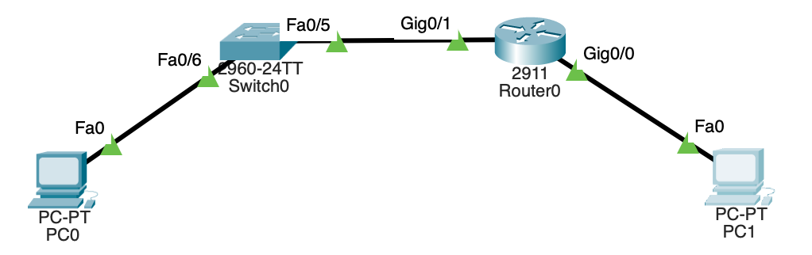

## 4. Лабораторная работа. Настройка IPv6-адресов на сетевых устройствах
____

**Топология**


**Таблица адресации**
| Устройство | Интерфейс | IPv6-адрес        | Длина префикса | Шлюз по умолчанию |
| ---------- | --------- | --------------- | ------------- | ------------- |
| R1         | G0/0/0    | 2001:db8:acad:a::1    | 64 | - |
|            | G0/0/1    | 2001:db8:acad:1::1    | 64 | - |
| S1         | VLAN 1    | 2001:db8:acad:1::b    | 64 | - |
| PC-A       | NIC       | 2001:db8:acad:1::3    | 64 | fe80::1 |
| PC-B       | NIC       | 2001:db8:acad:a::3    | 64 | fe80::1 |

**Задачи лабораторной работы:**
1. Настройка топологии конфигурации основных параметров маршрутизатор и коммутатора
2. Ручная настройка IPv6-адресов
3. Проверка сквозного соединения

___

**1. Создадим и настроим сеть**

В соответствии с заданной топологией смоделируем сеть в Cisco Packet Tracer

1.1. Настроим маршрутизатор\
Назначим имя хоста и настроим основные параметры устройства

```
Switch>en
Switch#conf term
Enter configuration commands, one per line.  End with CNTL/Z.
Switch(config)#hostname S1
S1(config)#service password-encryption
S1(config)#enable secret class
S1(config)#exit
S1#
%SYS-5-CONFIG_I: Configured from console by console
wr
Building configuration...
[OK]
S1#
```

Также установим шаблон
```
S1>en
Password: 
S1#conf term
Enter configuration commands, one per line.  End with CNTL/Z.
S1(config)#sdm prefer dual-ipv4-and-ipv6 default
Changes to the running SDM preferences have been stored, but cannot take effect until the next reload.
Use 'show sdm prefer' to see what SDM preference is currently active.
S1(config)#end
S1#
%SYS-5-CONFIG_I: Configured from console by console
wr
Building configuration...
[OK]
S1#
```

1.2. Настроим коммутатор\
Назначим имя хоста и настроим основные параметры устройства
```
Router>en
Router#conf term
Enter configuration commands, one per line.  End with CNTL/Z.
Router(config)#hostname R1
R1(config)#service password-encryption
R1(config)#enable secret class
R1(config)#exit
R1#
%SYS-5-CONFIG_I: Configured from console by console
wr
Building configuration...
[OK]
R1#
```
**Модель сети**


**2. Настроим протокол IPv6**

2.1. Назначим IPv6-адреса на интерфейсах Ethernet G0/0 и G0/1 на R1

```
R1>en
Password: 
R1#conf t
Enter configuration commands, one per line.  End with CNTL/Z.
R1(config)#int g0/0
R1(config-if)#ipv6 add
R1(config-if)#ipv6 address 2001:db8:acad:a::1/64
R1(config-if)#no shutdown 
R1(config-if)#end
R1#
%SYS-5-CONFIG_I: Configured from console by console
conf t
R1#conf terminal 
Enter configuration commands, one per line.  End with CNTL/Z.
R1(config)#int g0/1
R1(config-if)#ipv6 address 2001:db8:acad:1::1/64
R1(config-if)#no shutdown 
R1(config-if)#
R1(config-if)#
%LINEPROTO-5-UPDOWN: Line protocol on Interface GigabitEthernet0/0, changed state to down

R1(config-if)#end
R1#
%SYS-5-CONFIG_I: Configured from console by console
```
2.2. Проверим, назначен ли каждому интерфейсу корректный индивидуальные IPv6-адрес
```
R1#show ipv6 interface brief
GigabitEthernet0/0         [up/down]
    FE80::202:16FF:FE24:5A01
    2001:DB8:ACAD:A::1
GigabitEthernet0/1         [up/up]
    FE80::202:16FF:FE24:5A02
    2001:DB8:ACAD:1::1
GigabitEthernet0/2         [up/down]
    unassigned
Vlan1                      [up/down]
    unassigned
R1#
```
2.3. Зададим вручную локальные адреса канала на каждом интерфейсе Ethernet на R1
```
R1>en
Password: 
R1#conf t
Enter configuration commands, one per line.  End with CNTL/Z.	
R1(config)#int g0/0
R1(config-if)#ipv6 add
R1(config-if)#ipv6 address fe80::1 l
R1(config-if)#ipv6 address fe80::1 link-local 
R1(config-if)#no sh
R1(config-if)#
R1(config-if)#end
R1#
%SYS-5-CONFIG_I: Configured from console by console
conf t
Enter configuration commands, one per line.  End with CNTL/Z.
R1(config)#int g0/1
R1(config-if)#ipv6 add
R1(config-if)#ipv6 address fe80::1 l
R1(config-if)#ipv6 address fe80::1 link-local 
R1(config-if)#no sh
R1(config-if)#
R1(config-if)#end
R1#
%SYS-5-CONFIG_I: Configured from console by console
```
2.4. Убедимся что локальные адреса на интерфейсах выбраны fe80::1
```
R1# show ipv6 interface brief
GigabitEthernet0/0         [up/down]
    FE80::1
    2001:DB8:ACAD:A::1
GigabitEthernet0/1         [up/up]
    FE80::1
    2001:DB8:ACAD:1::1
GigabitEthernet0/2         [up/down]
    unassigned
Vlan1                      [up/down]
    unassigned
R1#
```

